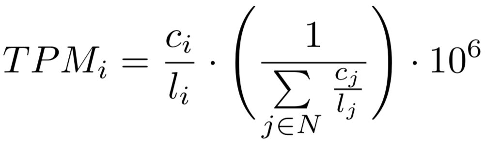

# Read count processing

You can apply additional processing to your read count table:

## Remove genes with zero read counts

If enabled, all genes with zero read counts are omitted from the table.

## Transpose matrix

You can use this option if you provided a transposed table (where the genes are the columns
  and the samples are the rows).

## Read count normalization

If your read counts are not normalized, it is advised to apply normalization.
Currently, you can choose to apply *library size normalization* with the
DESeq2 package or apply *within sample normalization* with TPM.

**Note that you can only normalize integer read counts.**

### DESeq2 normalization

Currently the DESeq2 normalization tool supports normalization. It uses the sample condition (see `Data > Sample annotation` help page for more information) as basis to build the design matrix.

### TPM normalization

TPM needs following information:

* The feature lengths or (recommended) the sum of the exon lengths *without overlap* of each gene
* The mean fragment length (optional, but recommended) of each sample

The feature length / exon length is provided by the gene annotation, while the
mean fragment length is provided by the sample annotation. See the respective help pages `Data > Gene annotation` and
`Data > Sample annotation` help page for more information.

We use the following formula to calculate the TPM value for one feature (gene) ``i``: 



where c<sub>i</sub> is the raw read count of gene i, l<sub>i</sub> is the effective length of
gene i and N is the number of all genes in the given annotation. The effective length of a gene i is calculated as: 

````
feature_length - mean_fragment_length + 1
````

if a mean fragment length is provided within the sample annotation, otherwise the effective length is simply the length of the feature obtained from 
the gene annotation.

This TPM equation was initially defined by <a href="https://www.ncbi.nlm.nih.gov/pubmed/20022975">Li _et al_., 2010</a> and 
exemplarily applied in the publications of <a href="https://www.ncbi.nlm.nih.gov/pmc/articles/PMC5240108/pdf/srep40599.pdf">Klassert _et al_., 2017</a> 
and <a href="https://www.ncbi.nlm.nih.gov/pmc/articles/PMC5240112/pdf/srep40598.pdf">Riege _et al_., 2017</a> 
from which one of our example data sets (``Monocytes``) is derived.

<div class="well help-box">
<label>Info</label>  We chose to not include normalization via RPKM/FPKM. See <a href="http://www.rna-seqblog.com/rpkm-fpkm-and-tpm-clearly-explained/" target="\_blank">here</a> and <a href="http://blog.nextgenetics.net/?e=51" target="\_blank">here</a> for great articles that give a summary about read count normalization and the issues with RPKM/FPKM.
</div>

## Remove genes with constant read counts

If enabled, all genes with constant read counts are omitted from the table.
This is needed if you want to apply variance scaling to the data before PCA as
genes with constant read counts have a variance of zero.
